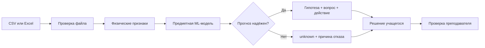

# PhysLab AI

[](https://github.com/k1slov-andrey/physlab-ai/actions/workflows/ci.yml)

> **Цифровая лаборатория умеет измерять. PhysLab AI помогает понять, что проверить дальше.**

PhysLab AI — локальный ML-инструмент для первичной диагностики школьного физического эксперимента. Система принимает файл измерений, проверяет его структуру, сопоставляет серию с физической моделью, формирует диагностическую гипотезу и предлагает проверяемое следующее действие. Если вход выходит за область применимости модели или прогноз недостаточно однозначен, система возвращает `unknown`, а не маскирует неопределённость уверенным ответом.

**Статус:** работающий end-to-end MVP  
**Траектория:** AI в образовании, JUNIOR ML CONTEST 2026  
**Автор:** Андрей Ильич Кислов  
**Главная граница:** окончательный вывод принимает учащийся и проверяет преподаватель

[Продуктовый документ](PRODUCT.md) · [Техническое приложение](TECHNICAL_APPENDIX.md)

## Проект за 30 секунд

| Что проверяет эксперт | Что реализовано |
|---|---|
| Пользовательская проблема | переход от «график не получился» к конкретному исследовательскому действию |
| Работающий продукт | Streamlit-приложение с загрузкой `CSV`, `XLSX`, `XLS` и четырьмя предметными модулями |
| ML-задача | многоклассовая диагностика 16 сценариев экспериментальных ошибок |
| Данные | 640 серий и 160 независимых экспериментальных семейств на каждый модуль |
| Валидация | group-aware `train / validation / test`, Grid Search без доступа к `test` |
| Надёжность | `unknown`, coverage, selective accuracy и диапазонные stress tests |
| Инженерия | Docker, GitHub Actions, фиксированное окружение, 60 тестов и 29 проверок артефактов |
| Применение генеративного ИИ | анализ требований, методологическое и код-ревью; каждое решение проверяется кодом, тестами и артефактами |
| Следующий шаг | teacher-in-the-loop пилот на экспертно размеченных реальных сериях |

## Почему проект нужен

Цифровые датчики ускоряют измерение и построение графиков, но не объясняют причину отклонения от физической зависимости. Учащемуся приходится самостоятельно решать, что проверять: единицы, датчик, отдельную точку, герметичность, массу, перемешивание или исходную гипотезу. Преподаватель может разобрать каждую серию вручную, но в классе одновременно работают несколько групп.

PhysLab AI закрывает промежуток между **получением данных** и **осмысленным исследовательским действием**:

```text
экспериментальный файл
        ↓
проверка структуры, единиц и диапазонов
        ↓
сравнение с физической моделью
        ↓
диагностическая гипотеза или unknown
        ↓
конкретный вопрос и следующее действие
        ↓
решение учащегося и проверка преподавателя
```

Система не выдаёт готовый лабораторный вывод и не выставляет оценку. Её задача — сделать отклонение проверяемым.

## Чем PhysLab AI отличается от существующих подходов

| Подход | Что делает хорошо | Чего не хватает в сценарии PhysLab AI |
|---|---|---|
| ПО цифровой лаборатории | собирает данные и строит графики | не диагностирует причину отклонения и не оценивает надёжность гипотезы |
| LMS | хранит задания и результаты | не анализирует временной ряд физического опыта |
| Универсальный чат-ассистент | объясняет физический закон | не имеет воспроизводимого предметного пайплайна, зафиксированной модели и области применимости |
| Ручная проверка преподавателя | учитывает контекст и педагогическую ситуацию | требует последовательного просмотра каждой работы |
| **PhysLab AI** | объединяет физическую модель, ML-диагностику, отказ `unknown` и teacher-in-the-loop | требует полевой калибровки на размеченных реальных сериях |

Ключевое отличие — не сам классификатор, а полный контур: **данные → физика → модель → evals → контроль отказа → действие человека**.

## Демо за 60 секунд

1. Запустите приложение:

```text
python -m streamlit run app.py
```

2. Выберите модуль **«Исследование нагревания и охлаждения»**.
3. Загрузите [`data/cooling/demo_sensor_drift.csv`](data/cooling/demo_sensor_drift.csv).
4. Проверьте маршрут результата: валидация файла, график, признаки, гипотеза `sensor_drift`, статус надёжности и рекомендуемое действие.
5. Для сравнения загрузите [`data/cooling/demo_normal.csv`](data/cooling/demo_normal.csv).



Демо использует сохранённые модели и примеры из репозитория. Переобучение для запуска не требуется.

## Что уже работает

### Четыре предметных модуля

| Лабораторная работа | Физическая зависимость | Диагностические сценарии |
|---|---|---|
| Нагревание и охлаждение | температура от времени | `normal`, `single_outlier`, `sensor_drift`, `high_noise` |
| Закон Бойля — Мариотта | `pV = const` | `normal`, `air_leak`, `temperature_change`, `volume_measurement_error` |
| Изохорный процесс | `p/T = const` | `normal`, `air_leak`, `volume_instability`, `temperature_sensor_lag` |
| Тепловой баланс | установление равновесия | `normal`, `heat_loss`, `mass_measurement_error`, `insufficient_mixing` |

### Полный пользовательский маршрут

- загрузка `CSV`, `XLSX` и `XLS`;
- проверка структуры, пропусков, дубликатов и физических диапазонов;
- сопоставление названий столбцов и преобразование единиц;
- построение экспериментальной и расчётной зависимостей;
- расчёт `RMSE`, `MAE`, `R²` и максимального отклонения;
- извлечение физически интерпретируемых признаков;
- классификация типового сценария;
- проверка надёжности прогноза;
- гипотеза, исследовательский вопрос и рекомендуемое действие;
- структурированный профиль исследовательских действий.

## Data Science: как получена оценка

### Единица эксперимента — семейство, а не отдельная строка

Четыре варианта одного опыта могут иметь одинаковые начальные условия, оборудование, частоту измерений и базовый шум. Случайное разбиение таких серий завысило бы качество за счёт сходства контекста.

Поэтому для каждого модуля сформировано 160 независимых экспериментальных семейств. Внутри одного семейства создаются четыре контрфактических сценария, и все они всегда остаются в одной части выборки.

| Часть | Серий | Семейств | Назначение |
|---|---:|---:|---|
| `train` | 320 | 80 | обучение кандидатов |
| `validation` | 160 | 40 | выбор семейства модели |
| `test` | 160 | 40 | однократная итоговая оценка |

Всего на модуль: **640 серий, 160 семейств и 160 примеров каждого класса**. Генерационные семейства между частями не пересекаются.

### Модель выбиралась экспериментом

1. `DummyClassifier` задаёт нижнюю границу Macro F1 = 0,100.
2. На `validation` сравниваются Logistic Regression, Random Forest и Gradient Boosting.
3. Победившее семейство проходит групповой Grid Search на `train + validation`.
4. Tuned-конфигурация применяется только при улучшении среднего CV Macro F1.
5. Выбранная конфигурация переобучается на development-части и один раз оценивается на `test`.

| Модуль | Baseline CV | Tuned CV | Выбранная конфигурация |
|---|---:|---:|---|
| Нагревание и охлаждение | 0,844 ± 0,028 | 0,844 ± 0,028 | baseline Random Forest |
| Закон Бойля — Мариотта | 0,956 ± 0,011 | 0,963 ± 0,009 | tuned Random Forest |
| Изохорный процесс | 0,979 ± 0,013 | 0,979 ± 0,013 | baseline Random Forest |
| Тепловой баланс | 0,835 ± 0,034 | 0,857 ± 0,024 | tuned Gradient Boosting |

Более сложная модель не выбиралась автоматически: для двух модулей Grid Search не дал улучшения, поэтому сохранён baseline.

### Итоговые показатели установленных моделей

Источник истины: [`evaluation/final_model_summary.csv`](evaluation/final_model_summary.csv).

| Лабораторная работа | Модель | Accuracy | Balanced Accuracy | Macro F1 | Групповой 95% CI |
|---|---|---:|---:|---:|---:|
| Нагревание и охлаждение | Random Forest | 0,875 | 0,875 | 0,876 | [0,827; 0,919] |
| Закон Бойля — Мариотта | Random Forest | 0,925 | 0,925 | 0,925 | [0,887; 0,962] |
| Изохорный процесс | Random Forest | 0,994 | 0,994 | 0,994 | [0,981; 1,000] |
| Тепловой баланс | Gradient Boosting | 0,888 | 0,888 | 0,887 | [0,831; 0,938] |

`Macro F1` используется как основная метрика, поскольку четыре класса внутри каждого модуля равнозначны. Доверительные интервалы рассчитаны групповым bootstrap по 40 тестовым семействам. Отдельно проверена чувствительность к пяти значениям `random_state`; стандартное отклонение Macro F1 находится в диапазоне 0,000–0,012.

Агрегированная метрика не скрывает слабые классы. Наиболее сложные сценарии: `normal` для охлаждения — F1 0,786; `normal` для Бойля — Мариотта — F1 0,867; `mass_measurement_error` — F1 0,835. Они зафиксированы как приоритет будущего сбора реальных данных.

Подробный EDA, class-level метрики, матрицы ошибок, важности признаков и расчёты доверительных интервалов описаны в [техническом приложении](TECHNICAL_APPENDIX.md); первичные таблицы и манифесты хранятся в [`evaluation/data_science/`](evaluation/data_science/).

## Надёжность: модель имеет право не отвечать

В образовательном сценарии уверенная ошибка опаснее честного отказа. Поэтому прогноз проходит через reliability-контур, построенный только по `train + validation`.

Проверяются:

- выход признаков за обучающий диапазон;
- сильный сдвиг отдельного признака;
- доля одновременно сдвинутых признаков;
- максимальная вероятность класса;
- разрыв между двумя ведущими классами.

| Модуль | Coverage | Selective accuracy | Selective Macro F1 | Перехвачено ошибок |
|---|---:|---:|---:|---:|
| Нагревание и охлаждение | 0,869 | 0,942 | 0,937 | 12 из 20 |
| Закон Бойля — Мариотта | 0,944 | 0,960 | 0,960 | 6 из 12 |
| Изохорный процесс | 1,000 | 0,994 | 0,994 | 0 из 1 |
| Тепловой баланс | 0,956 | 0,902 | 0,900 | 3 из 18 |

Два детерминированных диапазонных stress test отклоняются в 100% случаев во всех четырёх модулях. Это подтверждает техническую работу защиты, но не является доказательством качества на реальном OOD-корпусе.

## Инженерный паспорт

| Компонент | Реализовано |
|---|---|
| Архитектура | общий слой обработки файлов и четыре изолированных предметных модуля |
| Жизненный цикл | обучение, оценка и пользовательский инференс разделены |
| Артефактный контракт | модель, список признаков и reliability-профиль проверяются на согласованность |
| Воспроизводимость | Python 3.13, фиксированные зависимости, `seed=42`, split-манифесты |
| Контроль качества | 60 автоматических тестов и 29 проверок структуры, моделей и отчётов |
| CI | зависимости → тесты → артефакты → Docker → Streamlit health check |
| Развёртывание | локальный запуск и Docker; GPU не требуется |

Полная локальная проверка выполняется одной командой:

```text
python quality_check.py
```

Она проверяет компиляцию Python-файлов, тесты, окружение, актуальность метрик и аналитических артефактов, модели, split-манифесты и репозиторную гигиену.

## Быстрый запуск

Проект проверен на Python 3.13.

```text
git clone https://github.com/k1slov-andrey/physlab-ai.git
cd physlab-ai
python3 -m venv .venv
source .venv/bin/activate
python -m pip install --upgrade pip
python -m pip install -r requirements.txt
python -m streamlit run app.py
```

Приложение откроется по адресу `http://localhost:8501`.

### Проверка окружения

```text
python environment_check.py
```

Полный набор версий зафиксирован в `requirements.txt`, список прямых зависимостей — в `requirements-direct.txt`.

### Docker

```text
docker build -t physlab-ai .
docker run --rm -p 8501:8501 physlab-ai
```

### Полное воспроизведение моделей

```text
python build_all.py --n-per-class 160
python validate_and_gridsearch.py --mode quick --labs cooling boyle_mariotte --skip-streamlit --jobs 1 --apply
python validate_and_gridsearch.py --mode quick --labs isochoric heat_balance --skip-streamlit --jobs 1 --apply
python build_inference_profiles.py
python evaluate_deployed_models.py
python build_data_science_report.py
python quality_check.py
```

Grid Search без `--apply` создаёт отчёт и модель-кандидата, но не перезаписывает рабочий `best_model.joblib`.

## Реальные файлы и граница внешней валидности

В ходе разработки проведён аудит внешнего корпуса из 12 файлов и 25 таблиц. Он помог проверить реальные форматы, названия каналов и типовые проблемы импорта. После аудита реализован строгий селектор физических каналов: давление, расход, влажность, масса и объём не принимаются за температуру; решения о принятии и отклонении столбцов фиксируются в отчёте.

Первичные файлы `real_data_raw` не публикуются и отсутствуют в чистом клоне. Поэтому старые нормализованные серии и прогнозы не используются как доказательство качества. Конкурсные метрики относятся только к зафиксированной групповой синтетической `test`-части.

## Продуктовая проверка, а не обещание

Текущий MVP подтверждает техническую осуществимость. Следующий этап должен проверить три заранее сформулированные гипотезы:

1. модели сохраняют приемлемое качество при контролируемом coverage и `unknown` на разных датчиках и установках;
2. структурированная гипотеза улучшает исследовательские действия учащегося;
3. первичная диагностика сокращает время проверки преподавателя без снижения качества обратной связи.

Импакт будет измеряться через Macro F1, coverage, selective risk, качество исследовательских действий по рубрике, перенос навыка, время проверки и долю учащихся с адресной обратной связью.


## Применение генеративного ИИ

ChatGPT использовался в процессе разработки как инструмент анализа требований, инженерного и методологического ревью, подготовки вариантов реализации, поиска граничных случаев и технической редакции. Пользовательское приложение не обращается к языковой модели: обработка файлов, диагностика, `unknown` и рекомендации выполняются локально сохранёнными моделями и детерминированной предметной логикой.

Основные области применения:

- проверка протокола `train / validation / test` и риска выбора модели по `test`;
- анализ семантики `generation_group` и защита от утечки близких серий;
- ревью правил отбора физических столбцов во внешних файлах;
- проектирование `unknown`, class-level анализа, bootstrap и seed sensitivity;
- подготовка граничных тестовых случаев и сверка документации с артефактами;
- исследование российского рынка и формализация измеримого дизайна пилота.

В результате ревью были отклонены выбор модели по итоговой тестовой части, псевдоразметка внешних данных, случайное разделение близких серий, автоматическое применение Grid Search и обязательная классификация входов вне обучающей области. Принятые изменения включались в проект только после локального запуска и проверки тестами, CSV- и JSON-отчётами, сохранёнными моделями и физической интерпретацией. Автономные агенты не использовались; решения о данных, архитектуре, моделях и формулировках принимал автор.

## Личный вклад

Проект выполнен автором самостоятельно: от педагогической постановки задачи и физически обусловленной генерации до моделей, reliability-контура, Streamlit-интерфейса, Docker, CI, тестов, продуктовых гипотез и документации. Работа организована как end-to-end ответственность за проблему, данные, модель, evals, пользовательский сценарий и следующий полевой эксперимент.

Предметная основа выросла из выпускной квалификационной работы по применению цифровых лабораторий в молекулярной физике и термодинамике. Дальнейшая траектория проекта строится по логике:

```text
проблема → данные → модель → приложение → evals → пилот → измеримый эффект
```

## Текущий уровень доказательств

**Проверено в текущей версии:**

- end-to-end маршрут от файла до диагностической гипотезы и следующего действия;
- различимость 16 сценариев генератора на новых экспериментальных семействах;
- отсутствие групповой утечки и выбор моделей без доступа к `test`;
- воспроизводимость метрик, моделей и производных артефактов;
- количественная работа `unknown` и диапазонной защиты;
- локальный запуск, Docker, CI, 60 тестов и 29 инженерных проверок.

**План полевой проверки:**

- качество на реальных сериях, новых устройствах и лабораторных сессиях;
- калибровка порогов `unknown` и анализ неизвестных причин ошибок;
- изменение исследовательских действий учащегося;
- время первичного просмотра и маршрутизация работ преподавателем;
- перенос результата на ошибки, отсутствующие в текущем генераторе.

Полевой контур запланирован на период работы автора в Каире с сентября 2026 года по май 2027 года в рамках проекта «Российский учитель за рубежом». Предполагаются обезличенный сбор серий, экспертная разметка, `shadow mode`, разбиение по устройствам и сессиям, а затем контролируемый teacher-in-the-loop пилот. Подробный дизайн и критерии решений приведены в [PRODUCT.md](PRODUCT.md), технический протокол — в [TECHNICAL_APPENDIX.md](TECHNICAL_APPENDIX.md).

## Структура репозитория

```text
README.md                     основная конкурсная страница и быстрый запуск
PRODUCT.md                    пользователи, рынок, конкуренты, импакт и пилот
TECHNICAL_APPENDIX.md         архитектура, Data Science, evals, ИИ и воспроизводимость
app.py                        Streamlit-интерфейс
core/                         схемы, загрузка и общая обработка
labs/                         четыре предметных ML-модуля
data/                         синтетические выборки и демо-файлы
evaluation/                   метрики, прогнозы, EDA и split-манифесты
models/                       рабочие модели и reliability-профили
tests/                        автоматические тесты
build_all.py                  генерация и базовое обучение
validate_and_gridsearch.py    групповой выбор конфигураций
evaluate_deployed_models.py   оценка установленных моделей
build_data_science_report.py  сборка и проверка аналитических артефактов
quality_check.py              единая проверка проекта
```

## Навигация

- **README.md** — проблема, демо, ключевые метрики, надёжность, запуск и личный вклад;
- **[PRODUCT.md](PRODUCT.md)** — российский рынок, пользователи, конкуренты, гипотезы, импакт и дизайн пилота;
- **[TECHNICAL_APPENDIX.md](TECHNICAL_APPENDIX.md)** — архитектура, данные, модели, evals, использование генеративного ИИ и воспроизводимость;
- **[`evaluation/`](evaluation/)** — первичные CSV- и JSON-артефакты, прогнозы, манифесты разбиения и аналитические таблицы.

## Автор

**Андрей Ильич Кислов** — выпускник УлГПУ им. И. Н. Ульянова по профилю «Физика. Информатика». PhysLab AI соединяет предметную физику, педагогическое проектирование, Data Science и инженерную разработку в одном проверяемом продукте.
