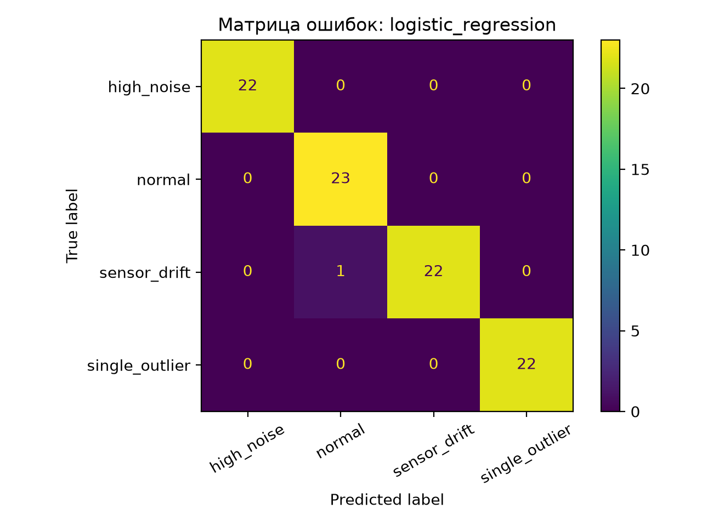

# PhysLab AI

ML-система диагностики лабораторных работ по физике на основе закона охлаждения Ньютона.

Проект автоматически анализирует временной ряд охлаждения жидкости, оценивает соответствие физической модели, извлекает интерпретируемые признаки и определяет наиболее вероятную причину отклонения эксперимента.

---

## Проблема

Во многих цифровых лабораториях автоматически строятся графики температуры, однако преподавателю всё равно приходится самостоятельно отвечать на вопросы:

- является ли эксперимент корректным;
- соответствует ли измерение закону охлаждения Ньютона;
- какая ошибка наиболее вероятна;
- что именно следует проверить учащемуся.

При работе с группой студентов анализ десятков временных рядов занимает значительное время и зависит от опыта преподавателя.

---

## Решение

PhysLab автоматизирует полный цикл диагностики.

```
CSV-файл измерений
          ↓
Проверка и очистка данных
          ↓
Аппроксимация закона охлаждения Ньютона
          ↓
Расчет физических и статистических признаков
          ↓
ML-классификация
          ↓
Диагноз + вероятность + рекомендация
```

Система не только классифицирует эксперимент, но и показывает физическую интерпретацию результата.

---

## Используемые технологии

- Python 3.13
- Scikit-learn
- Pandas
- NumPy
- SciPy
- Streamlit
- Joblib
- Matplotlib

---

## Диагностируемые классы

### Корректный эксперимент

Эксперимент соответствует физической модели.

### Единичный выброс

В одном измерении присутствует аномальное значение температуры.

### Дрейф датчика

Показания постепенно смещаются относительно физической модели.

### Повышенный шум

Наблюдаются случайные высокочастотные колебания температуры.

---

## Извлекаемые признаки

Перед классификацией вычисляются физически интерпретируемые характеристики:

- максимальный скачок температуры;
- стандартное отклонение остатков;
- максимальное отклонение от модели;
- изменение среднего остатка;
- RMSE физической модели;
- коэффициент детерминации R².

Дополнительно оцениваются параметры закона охлаждения Ньютона:

- начальная температура;
- температура окружающей среды;
- коэффициент охлаждения.

---

## Используемая модель

После сравнения нескольких алгоритмов лучшей оказалась модель **Logistic Regression**.

Преимущества выбора:

- высокая точность;
- быстрый вывод результата;
- устойчивость;
- интерпретируемые вероятности классов.

---

## Результаты

### Строгая независимая проверка

Проверка проводилась на отдельном синтетическом наборе данных, который не использовался при обучении модели.

| Метрика | Значение |
|---------|---------:|
| Accuracy | **98.44 %** |
| Macro F1 | **98.44 %** |

Матрица ошибок:



---

## Сравнение с физико-статистическим baseline

Для проверки необходимости машинного обучения был реализован отдельный baseline на основе набора экспертных правил.

Baseline использовал три показателя:

- максимальный скачок температуры;
- стандартное отклонение остатков;
- изменение среднего остатка.

Пороговые значения определялись только по обучающей выборке и затем проверялись на той же независимой тестовой выборке.

| Подход | Accuracy | Macro F1 |
|---------|---------:|---------:|
| Статистические правила | 52.5 % | 49.6 % |
| Logistic Regression | **98.4 %** | **98.4 %** |

Полученные результаты показывают, что фиксированные пороговые правила оказываются недостаточно устойчивыми при изменении физических параметров эксперимента.

По сравнению с baseline использование машинного обучения обеспечивает прирост примерно:

- **+46 процентных пунктов Accuracy**;
- **+49 процентных пунктов Macro F1**.

Это подтверждает необходимость применения ML для совместного анализа нескольких физических и статистических признаков.

---

## Возможности веб-приложения

Пользователь может:

- выбрать демонстрационный эксперимент;
- загрузить собственный CSV-файл;
- просмотреть исходные измерения;
- построить график охлаждения;
- увидеть аппроксимацию физической модели;
- получить вероятности всех классов;
- ознакомиться с рассчитанными признаками;
- получить рекомендацию по устранению ошибки.

---

## Структура проекта

```
physlab-ai/
│
├── app.py
├── README.md
├── requirements.txt
│
├── models/
│   ├── best_model.joblib
│   └── feature_names.joblib
│
├── data/
│   ├── ml_dataset.csv
│   ├── features.csv
│   ├── model_metrics.csv
│   ├── baseline_comparison.csv
│   ├── confusion_matrix.png
│   ├── normal_cooling_experiment.csv
│   ├── single_outlier_experiment.csv
│   ├── sensor_drift_experiment.csv
│   ├── high_noise_experiment.csv
│   └── strict_validation_results.csv
│
└── src/
    ├── generate_cooling.py
    ├── generate_dataset.py
    ├── feature_engineering.py
    ├── train_model.py
    ├── predict.py
    ├── strict_validation.py
    ├── statistical_baseline.py
    └── create_demo_files.py
```

---

## Перспективы развития

Следующие этапы проекта:

- проверка на реальных данных цифровых лабораторий;
- поддержка нескольких физических моделей;
- автоматическое обнаружение новых типов ошибок;
- интеграция с цифровыми образовательными платформами;
- формирование персонализированных рекомендаций учащимся.

---

## Автор

Андрей Кислов

Проект разработан в рамках исследования применения методов машинного обучения для автоматизации диагностики лабораторных работ по физике.